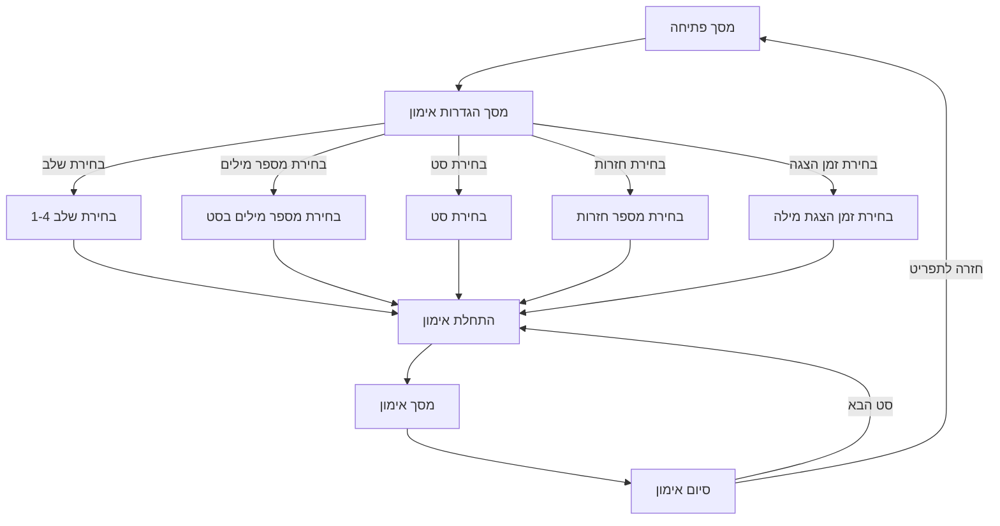

# תוכנית יישום - הוספת אפשרות בחירת שלב

## מטרת השינוי

הוספת אפשרות לבחירת שלב (level) במסך הגדרות האימון. כרגע המערכת תומכת רק בשלב 1, ואנו רוצים להוסיף תמיכה בשלבים נוספים (כרגע שלב 2, ובעתיד עוד שלבים).

## שינויים נדרשים

### 1. עדכון קובץ words.json

יש לעדכן את קובץ `src/lib/data/words.json` כדי לכלול את כל השלבים (1-4) עם המילים המתאימות מקובץ `word-list.md`:

```json
{
	"level_1": [
		"בָּאָה",
		"בָּכָה",
		"בָּלַע",
		"בָּמָה",
		"בָּנָה",
		"גָרָה",
		"דָגָה",
		"זָזָה",
		"חַדָה",
		"חַוָה",
		"חַיָה",
		"חַכָּה",
		"חַלָה",
		"חַמָה",
		"טָסָה",
		"יָפָה",
		"כַּלָה",
		"מָרָה",
		"נָאָה",
		"נָגַע",
		"נָחָה",
		"נָמָה",
		"סַפָּה",
		"עָלָה",
		"עָנָה",
		"עָפָה",
		"פָּנָה",
		"פָּרָה",
		"צַמָה",
		"קָמָה",
		"קָנָה",
		"קָרָא",
		"קָרַע",
		"רָאָה",
		"רָבָה",
		"רָזָה",
		"רַכָּה",
		"שָטָה",
		"שָׁעָה",
		"שָרָה",
		"שָׁתָה"
	],
	"level_2": [
		"אָבָק",
		"אַגָס",
		"אָחַז",
		"אָכַל",
		"בָּדַק",
		"בָּחַשׁ",
		"גָּדַל",
		"גָּזַר",
		"גָּלַשׁ",
		"גַּמָּד",
		"דָּאַג",
		"הָלַךְ",
		"זָהָב",
		"זָלַל",
		"זָנָב",
		"זָקָן",
		"זָרַק",
		"חָדָשׁ",
		"חָזָק",
		"חָזַר",
		"חָצָב",
		"חָצָץ",
		"חָתַךְ",
		"יַעַר",
		"יָקָר",
		"יָרַד",
		"יָשַׁב",
		"כָּאַב",
		"לָבָן",
		"לָעַס",
		"לָקַח",
		"מַגָּף",
		"מַגָש",
		"מָדַד",
		"מַחַט",
		"מָחַק",
		"מָסַר",
		"נָבַח",
		"נָהָר",
		"נָחַל",
		"נַעַל",
		"נַעַר",
		"נָפַל",
		"סַבָּא",
		"סַהַר",
		"עָנָן",
		"עָקַץ",
		"עָשָׁן",
		"פָּנָס",
		"פָּתַח",
		"רַעַם",
		"שָׁאַג",
		"שָׂמַח",
		"שָׁמַר",
		"שַׁעַר",
		"שָׂפָם",
		"תָּפַר"
	],
	"level_3": [
		"מָצְאָה",
		"חַשְׁמַל",
		"נָסְעָה",
		"נָפְלָה",
		"סַפְסָל",
		"אַרְנָק",
		"קַנְקַן",
		"מַלְכָּה",
		"עַרְסָל",
		"פַּרְוָה",
		"יַלְדָּה",
		"קַלְמָר",
		"גָּזְרָה",
		"בָּנְתָה",
		"כָּתְבָה",
		"יָשְׁבָה",
		"קָנְתָה",
		"אָפְתָה",
		"גָּדְלָה",
		"גַּלְשָׁן",
		"גָּלְשָׁה",
		"עָשְׂתָה",
		"אַרְגָּז",
		"סַנְדָּל",
		"חָשְׁבָה",
		"סַרְטָן",
		"עָלְתָה",
		"אָסְפָה",
		"גַּלְגַּל",
		"מַחְסָן",
		"שָׁלוֹם",
		"אָכְלָה",
		"לָבְשָׁה",
		"בָּלְעָה",
		"אָמְרָה",
		"לָמְדָה",
		"שָׁמְעָה",
		"עָנְתָה",
		"בָּרְחָה",
		"פָּנְתָה",
		"חָנְתָה",
		"הָלְכָה",
		"קָרְאָה"
	],
	"level_4": [
		"לָעֲסָה",
		"רָאֲתָה",
		"צָעֲדָה",
		"רָחֲצָה",
		"זָחֲלָה",
		"צָעֲקָה",
		"הֲנָאָה",
		"תַּחֲנָה",
		"בַּקָּשָׁה",
		"חַבָּלָה",
		"נַעֲרָה",
		"אֲדָמָה",
		"הַצָּגָה",
		"מַחֲלָה",
		"טָעֲתָה",
		"עֲגָלָה",
		"כָּעֲסָה",
		"בָּחֲשָׁה",
		"חֲמָמָה",
		"מַתָּנָה",
		"שָׂחֲתָה",
		"טָעֲמָה",
		"חֲכָמָה",
		"חֲזָקָה",
		"צָחֲקָה",
		"חַלָּשָׁה",
		"חֲדָשָׁה",
		"בָּחֲנָה",
		"רָעֲדָה",
		"שָׁאֲלָה",
		"פָּחֲדָה",
		"דָּאֲגָה",
		"לָעֲגָה"
	]
}
```

### 2. עדכון קובץ words.ts

יש לעדכן את קובץ `src/lib/data/words.ts` כדי לטעון את כל השלבים:

```typescript
import type { WordList } from '../types';
import { WordUtils } from '../utils/wordUtils';
import wordList from './words.json';

const IMAGE_EXTENSIONS = ['jpg', 'png', 'jpeg'] as const;

function getImagePath(word: string): string | false {
	const cleanWord = WordUtils.removeNiqqud(word);

	for (const ext of IMAGE_EXTENSIONS) {
		const fileName = `${cleanWord}.${ext}`;
		const files = [
			'באה.jpg',
			'בכה.jpg',
			'בכה.png',
			'בלע.jpg',
			'במה.png',
			'בנה.png',
			'גרה.png',
			'דגה.jpeg',
			'זזה.png',
			'חדה.png',
			'חוה.png',
			'חיה.png',
			'חכה.jpeg',
			'חלה.jpeg',
			'חמה.jpeg',
			'טסה.jpeg',
			'כלה.png',
			'מרה.png',
			'נאה.png',
			'נגע.png',
			'נמה.png',
			'ספה.jpeg',
			'עלה.png',
			'ענה.png',
			'עפה.png',
			'פנה.jpg',
			'פרה.jpeg',
			'צמה.png',
			'קמה.png',
			'קנה.png',
			'קרא.png',
			'קרע.png',
			'ראה.png',
			'רבה.png',
			'רזה.png',
			'רכה.png',
			'שטה.png',
			'שעה.png',
			'שרה.png',
			'שתה.png'
		];

		if (files.includes(fileName)) {
			return `/images/${fileName}`;
		}
	}

	return false;
}

// טעינת מילים מכל השלבים
const level1Words = wordList.level_1.map((word) => ({
	text: word,
	image: getImagePath(word),
	level: 1
}));

const level2Words = wordList.level_2.map((word) => ({
	text: word,
	image: getImagePath(word),
	level: 2
}));

const level3Words =
	wordList.level_3?.map((word) => ({
		text: word,
		image: getImagePath(word),
		level: 3
	})) || [];

const level4Words =
	wordList.level_4?.map((word) => ({
		text: word,
		image: getImagePath(word),
		level: 4
	})) || [];

// איחוד כל המילים לרשימה אחת
export const words: WordList = [...level1Words, ...level2Words, ...level3Words, ...level4Words];

// פונקציה לסינון מילים לפי שלב
export function getWordsByLevel(level: number): WordList {
	return words.filter((word) => word.level === level);
}
```

### 3. עדכון קובץ config.ts

יש לעדכן את קובץ `src/lib/constants/config.ts` כדי להוסיף הגדרות ברירת מחדל לשלבים:

```typescript
export const CONFIG = {
	cloudinary: {
		cloudName: 'your-cloud-name',
		folder: 'words',
		defaultFormat: 'webp',
		defaultSize: '300x300'
	},
	app: {
		defaultWordsPerSet: 5,
		minWordsPerSet: 1,
		maxWordsPerSet: 10,
		defaultRepetitions: 1,
		minRepetitions: 1,
		maxRepetitions: 5,
		transitionDuration: 500,
		defaultHideSeconds: 0,
		minHideSeconds: 1,
		maxHideSeconds: 10,
		defaultLevel: 1, // שלב ברירת מחדל
		maxLevel: 4 // מספר השלבים המקסימלי
	}
};
```

### 4. עדכון טיפוס Progress ב-types/index.ts

יש לעדכן את קובץ `src/lib/types/index.ts` כדי להוסיף שדה `level` לטיפוס `Progress`:

```typescript
import type { Readable } from 'svelte/store';

export interface WordState {
	wordsPerSet: number;
	currentSet: number;
	currentWordIndex: number;
	totalSets: number;
	currentSetWords: string[];
	totalWords: number;
}

export interface WordSessionState {
	words: Word[]; // רשימת המילים המלאה כולל חזרות
	currentIndex: number; // האינדקס הנוכחי
	wordsPerRepetition: number; // כמה מילים בכל חזרה
	totalRepetitions: number; // כמה חזרות סה"כ
}

export type DerivedBoolean = Readable<boolean>;

export interface Progress {
	currentSet: number;
	wordsPerSet: number;
	repetitionsPerSet: number;
	hideAfterSeconds: number;
	level: number; // שלב נוכחי
}

export interface Word {
	text: string; // המילה עם ניקוד
	image?: string | false; // נתיב לתמונה (אופציונלי)
	level: number; // רמת הקושי
	type?: 'verb'; // סוג המילה
}

export type WordList = Word[];
```

### 5. עדכון WordUtils.ts

יש לעדכן את קובץ `src/lib/utils/wordUtils.ts` כדי להוסיף תמיכה בשלבים:

```typescript
import type { Progress, Word, WordSessionState } from '$lib/types';
import { CONFIG } from '$lib/constants/config';
import { loadProgress, saveProgress } from '$lib/utils/localStorage';

// פונקציית עזר לערבוב מערך
export function shuffle<T>(array: T[]): T[] {
	const newArray = [...array];
	for (let i = newArray.length - 1; i > 0; i--) {
		const j = Math.floor(Math.random() * (i + 1));
		[newArray[i], newArray[j]] = [newArray[j], newArray[i]];
	}
	return newArray;
}

// ניהול סשן אימון
export const WordSession = {
	create(originalWords: Word[], repetitions: number, startIndex: number = 0): WordSessionState {
		// יוצרים את רשימת המילים עם החזרות
		const allWords = Array(repetitions).fill(originalWords).flat();

		// וידוא שהאינדקס ההתחלתי תקין
		const validStartIndex = Math.min(Math.max(0, startIndex), allWords.length - 1);

		return {
			words: allWords,
			currentIndex: validStartIndex,
			wordsPerRepetition: originalWords.length,
			totalRepetitions: repetitions
		};
	},

	next(state: WordSessionState): WordSessionState {
		if (state.currentIndex < state.words.length - 1) {
			return { ...state, currentIndex: state.currentIndex + 1 };
		}
		return state;
	},

	prev(state: WordSessionState): WordSessionState {
		if (state.currentIndex > 0) {
			return { ...state, currentIndex: state.currentIndex - 1 };
		}
		return state;
	},

	getCurrentRepetition(state: WordSessionState): number {
		return Math.floor(state.currentIndex / state.wordsPerRepetition) + 1;
	},

	getCurrentWord(state: WordSessionState): Word {
		// בדיקת תקינות האינדקס
		if (state.currentIndex < 0 || state.currentIndex >= state.words.length) {
			return state.words[0]; // החזרת המילה הראשונה כברירת מחדל
		}
		return state.words[state.currentIndex];
	},

	getProgress(state: WordSessionState): { current: number; total: number } {
		return {
			current: (state.currentIndex % state.wordsPerRepetition) + 1,
			total: state.wordsPerRepetition
		};
	},

	isComplete(state: WordSessionState): boolean {
		return state.currentIndex === state.words.length - 1;
	}
};

// חישובים ובדיקות תקינות
export const WordSetCalculator = {
	calculateTotalSets(words: Word[], wordsPerSet: number, level?: number): number {
		const filteredWords = level ? words.filter((word) => word.level === level) : words;
		const totalWords = filteredWords.length;
		return Math.ceil(totalWords / wordsPerSet);
	},

	getWordsForSet(words: Word[], set: number, wordsPerSet: number, level?: number): Word[] {
		const filteredWords = level ? words.filter((word) => word.level === level) : words;
		const startIndex = (set - 1) * wordsPerSet;
		return filteredWords.slice(startIndex, startIndex + wordsPerSet);
	},

	validateWordsPerSet(count: number): boolean {
		return count >= CONFIG.app.minWordsPerSet && count <= CONFIG.app.maxWordsPerSet;
	},

	validateSetNumber(setNumber: number, totalSets: number): boolean {
		return setNumber > 0 && setNumber <= totalSets;
	},

	validateRepetitions(repetitions: number): boolean {
		return repetitions >= CONFIG.app.minRepetitions && repetitions <= CONFIG.app.maxRepetitions;
	},

	// פונקציה חדשה לבדיקת תקינות שלב
	validateLevel(level: number, maxLevel: number = CONFIG.app.maxLevel): boolean {
		return level > 0 && level <= maxLevel;
	},

	// פונקציה חדשה לקבלת מילים לפי שלב
	getWordsByLevel(words: Word[], level: number): Word[] {
		return words.filter((word) => word.level === level);
	}
};

// ניהול התקדמות
export const WordProgress = {
	load(): Progress | null {
		return loadProgress();
	},

	save(
		currentSet: number,
		wordsPerSet: number,
		repetitionsPerSet: number = CONFIG.app.defaultRepetitions,
		hideAfterSeconds: number = CONFIG.app.defaultHideSeconds,
		level: number = CONFIG.app.defaultLevel
	): void {
		const progress: Progress = {
			currentSet,
			wordsPerSet,
			repetitionsPerSet,
			hideAfterSeconds,
			level
		};
		saveProgress(progress);
	}
};

// פונקציות עזר
export const WordUtils = {
	removeNiqqud(text: string): string {
		return text
			.normalize('NFD')
			.replace(/[\u0591-\u05C7]/g, '') // הסרת ניקוד עברי
			.normalize('NFC');
	}
};
```

### 6. עדכון מסך הגדרות האימון (PracticeSettingsScreen.svelte)

יש לעדכן את קובץ `src/lib/components/screens/PracticeSettingsScreen.svelte` כדי להוסיף אפשרות לבחירת שלב:

```svelte
<script lang="ts">
	import Button from '$lib/components/ui/Button.svelte';
	import { goto } from '$app/navigation';
	import { CONFIG } from '$lib/constants/config';

	interface Props {
		wordsPerSet: number;
		currentSet: number;
		totalSets: number;
		repetitionsPerSet: number;
		hideAfterSeconds: number;
		level: number; // הוספת שלב
		maxLevel: number; // מספר השלבים המקסימלי
		onStartPractice: (
			wordsPerSet: number,
			set: number,
			repetitions: number,
			hideAfterSeconds: number,
			level: number // הוספת שלב
		) => void;
	}

	const {
		currentSet,
		hideAfterSeconds,
		onStartPractice,
		repetitionsPerSet,
		totalSets,
		wordsPerSet,
		level = CONFIG.app.defaultLevel,
		maxLevel = CONFIG.app.maxLevel
	}: Props = $props();

	const state = $state({
		selectedWordsPerSet: wordsPerSet,
		selectedSet: currentSet,
		selectedRepetitions: repetitionsPerSet,
		hideAfterSeconds: hideAfterSeconds,
		selectedLevel: level // הוספת שלב נבחר
	});

	function handleStartPractice() {
		onStartPractice(
			state.selectedWordsPerSet,
			state.selectedSet,
			state.selectedRepetitions,
			state.hideAfterSeconds,
			state.selectedLevel // העברת השלב הנבחר
		);
	}

	function handleBack() {
		goto('/welcome');
	}
</script>

<div class="flex flex-col items-center justify-center space-y-8 px-4 py-12">
	<h1 class="text-4xl font-bold">הגדרות תרגול</h1>

	<div class="flex flex-col items-center space-y-6">
		<!-- הוספת בחירת שלב -->
		<div class="space-y-2 text-center">
			<label for="level-select" class="block font-medium">שלב</label>
			<select
				id="level-select"
				class="w-32 rounded-lg border p-2 text-center"
				bind:value={state.selectedLevel}
			>
				{#each Array(maxLevel) as _, i}
					<option value={i + 1}>שלב {i + 1}</option>
				{/each}
			</select>
		</div>

		<div class="space-y-2 text-center">
			<label for="words-num" class="block font-medium">מספר מילים בכל סט</label>
			<select
				id="words-num"
				class="w-32 rounded-lg border p-2 text-center"
				bind:value={state.selectedWordsPerSet}
			>
				<option value={3}>3 מילים</option>
				<option value={5}>5 מילים</option>
				<option value={10}>10 מילים</option>
			</select>
		</div>

		<div class="space-y-2 text-center">
			<label for="set-num" class="block font-medium">סט מספר</label>
			<select
				id="set-num"
				class="w-32 rounded-lg border p-2 text-center"
				bind:value={state.selectedSet}
			>
				{#each Array(totalSets) as _, i}
					<option value={i + 1}>סט {i + 1}</option>
				{/each}
			</select>
		</div>

		<div class="space-y-2 text-center">
			<label for="repetitions-num" class="block font-medium">מספר חזרות על כל סט</label>
			<select
				id="repetitions-num"
				class="w-32 rounded-lg border p-2 text-center"
				bind:value={state.selectedRepetitions}
			>
				<option value={1}>חזרה אחת</option>
				<option value={2}>2 חזרות</option>
				<option value={3}>3 חזרות</option>
				<option value={5}>5 חזרות</option>
			</select>
		</div>

		<div class="space-y-2 text-center">
			<label class="block font-medium" for="hide-after-seconds">
				זמן הצגת המילה:
				<span>
					{#if state.hideAfterSeconds === 0}
						ללא הגבלת זמן
					{:else}
						{state.hideAfterSeconds} שניות
					{/if}
				</span>
			</label>
			<div class="flex items-center gap-2">
				<span class="text-sm">0</span>
				<input
					id="hide-after-seconds"
					type="range"
					min="0"
					max="10"
					step="1"
					class="accent-primary h-2 w-48 cursor-pointer appearance-none rounded-lg bg-gray-200"
					bind:value={state.hideAfterSeconds}
				/>
				<span class="text-sm">10</span>
			</div>
			<div class="text-sm text-gray-500">
				{#if state.hideAfterSeconds === 0}
					המילה תוצג ללא הגבלת זמן
				{:else}
					המילה תוסתר אחרי {state.hideAfterSeconds} שניות
				{/if}
			</div>
		</div>
	</div>

	<div class="flex gap-4">
		<Button onclick={handleBack} variant="secondary">חזרה</Button>
		<Button onclick={handleStartPractice}>התחל תרגול</Button>
	</div>
</div>
```

### 7. עדכון דף הגדרות האימון (practice/settings/+page.svelte)

יש לעדכן את קובץ `src/routes/practice/settings/+page.svelte` כדי לתמוך בפרמטר השלב:

```svelte
<script lang="ts">
	import { goto } from '$app/navigation';
	import { CONFIG } from '$lib/constants/config';
	import { WordSetCalculator } from '$lib/utils/wordUtils';
	import { words } from '$lib/data/words';
	import PracticeSettingsScreen from '$lib/components/screens/PracticeSettingsScreen.svelte';
	import { WordProgress } from '$lib/utils/wordUtils';

	// טעינת הגדרות שמורות
	const savedProgress = WordProgress.load();

	// הגדרת ערכי ברירת מחדל
	const defaultWordsPerSet = CONFIG.app.defaultWordsPerSet;
	const defaultRepetitions = CONFIG.app.defaultRepetitions;
	const defaultHideSeconds = CONFIG.app.defaultHideSeconds;
	const defaultLevel = CONFIG.app.defaultLevel;

	// שימוש בהגדרות שמורות אם קיימות
	const wordsPerSet = savedProgress?.wordsPerSet || defaultWordsPerSet;
	const repetitionsPerSet = savedProgress?.repetitionsPerSet || defaultRepetitions;
	const hideAfterSeconds = savedProgress?.hideAfterSeconds || defaultHideSeconds;
	const level = savedProgress?.level || defaultLevel;
	const currentSet = savedProgress?.currentSet || 1;

	// סינון מילים לפי שלב
	const levelWords = words.filter((word) => word.level === level);

	// חישוב מספר הסטים הכולל
	const totalSets = WordSetCalculator.calculateTotalSets(levelWords, wordsPerSet);

	// פונקציה להתחלת אימון
	function handleStartPractice(
		selectedWordsPerSet: number,
		selectedSet: number,
		selectedRepetitions: number,
		selectedHideAfterSeconds: number,
		selectedLevel: number
	) {
		// שמירת ההגדרות
		WordProgress.save(
			selectedSet,
			selectedWordsPerSet,
			selectedRepetitions,
			selectedHideAfterSeconds,
			selectedLevel
		);

		// ניווט לדף האימון
		goto(
			`/practice?set=${selectedSet}&wordsPerSet=${selectedWordsPerSet}&repetitions=${selectedRepetitions}&hideAfterSeconds=${selectedHideAfterSeconds}&wordIndex=1&level=${selectedLevel}`
		);
	}
</script>

<PracticeSettingsScreen
	{wordsPerSet}
	{currentSet}
	{totalSets}
	{repetitionsPerSet}
	{hideAfterSeconds}
	{level}
	maxLevel={CONFIG.app.maxLevel}
	onStartPractice={handleStartPractice}
/>
```

### 8. עדכון דף האימון (practice/+page.ts)

יש לעדכן את קובץ `src/routes/practice/+page.ts` כדי לתמוך בפרמטר השלב:

```typescript
import type { PageLoad } from './$types';
import { CONFIG } from '$lib/constants/config';
import { WordSetCalculator } from '$lib/utils/wordUtils';
import { words } from '$lib/data/words';

export const load = (async ({ url }) => {
	// קריאת פרמטרים מה-URL עם ערכי ברירת מחדל
	let wordsPerSet = parseInt(
		url.searchParams.get('wordsPerSet') || CONFIG.app.defaultWordsPerSet.toString(),
		10
	);
	let set = parseInt(url.searchParams.get('set') || '1', 10);
	let repetitions = parseInt(
		url.searchParams.get('repetitions') || CONFIG.app.defaultRepetitions.toString(),
		10
	);
	let hideAfterSeconds = parseInt(
		url.searchParams.get('hideAfterSeconds') || CONFIG.app.defaultHideSeconds.toString(),
		10
	);
	let wordIndex = Math.max(0, parseInt(url.searchParams.get('wordIndex') || '1', 10) - 1);

	// הוספת פרמטר שלב
	let level = parseInt(url.searchParams.get('level') || CONFIG.app.defaultLevel.toString(), 10);

	// בדיקת תקינות מספר המילים בסט
	if (!WordSetCalculator.validateWordsPerSet(wordsPerSet)) {
		wordsPerSet = CONFIG.app.defaultWordsPerSet;
	}

	// בדיקת תקינות השלב
	if (!WordSetCalculator.validateLevel(level, CONFIG.app.maxLevel)) {
		level = CONFIG.app.defaultLevel;
	}

	// סינון מילים לפי שלב
	const levelWords = words.filter((word) => word.level === level);

	// חישוב מספר הסטים הכולל
	const totalSets = WordSetCalculator.calculateTotalSets(levelWords, wordsPerSet);

	// בדיקת תקינות מספר הסט
	if (!WordSetCalculator.validateSetNumber(set, totalSets)) {
		set = 1;
	}

	// בדיקת תקינות מספר החזרות
	if (!WordSetCalculator.validateRepetitions(repetitions)) {
		repetitions = CONFIG.app.defaultRepetitions;
	}

	// בדיקת תקינות זמן הסתרה
	if (hideAfterSeconds < 0) {
		hideAfterSeconds = CONFIG.app.defaultHideSeconds;
	}

	// בדיקת תקינות אינדקס המילה
	const currentSetWords = WordSetCalculator.getWordsForSet(levelWords, set, wordsPerSet);
	const maxWordIndex = currentSetWords.length * repetitions - 1;
	if (wordIndex < 0 || wordIndex > maxWordIndex) {
		wordIndex = 0;
	}

	return {
		wordsPerSet,
		set,
		repetitions,
		hideAfterSeconds,
		wordIndex,
		level
	};
}) satisfies PageLoad;
```

### 9. עדכון דף האימון (practice/+page.svelte)

יש לעדכן את קובץ `src/routes/practice/+page.svelte` כדי לתמוך בפרמטר השלב:

```svelte
<script lang="ts">
	import { goto } from '$app/navigation';
	import { WordSession, WordSetCalculator, WordProgress } from '$lib/utils/wordUtils';
	import { CONFIG } from '$lib/constants/config';
	import PracticeScreen from '$lib/components/screens/PracticeScreen.svelte';
	import PracticeCompletionScreen from '$lib/components/screens/PracticeCompletionScreen.svelte';
	import { words } from '$lib/data/words';
	import { setupKeyboardShortcuts } from '$lib/core/keyboard';
	import { fade } from '$lib/utils/transitions';
	import type { Word, WordSessionState } from '$lib/types';

	// פרמטרים מהניתוב
	const { data } = $props();
	const hideAfterSeconds = data.hideAfterSeconds ?? CONFIG.app.defaultHideSeconds;
	let { set, wordsPerSet, repetitions, wordIndex, level } = data;

	// סינון מילים לפי שלב
	const levelWords = $derived.by(() => words.filter((word) => word.level === level));

	let currentSetWords: Word[] = [];
	let sessionState: WordSessionState;
	let session: WordSessionState = $state({
		words: [],
		currentIndex: 0,
		wordsPerRepetition: 0,
		totalRepetitions: 0
	});

	// חישוב מספר הסטים הכולל
	const totalSets = $derived.by(() =>
		WordSetCalculator.calculateTotalSets(levelWords, data.wordsPerSet)
	);

	// מצב השלמת הסט
	let isCompleted = $state(false);

	startSession();

	// מצב גלוי/מוסתר של התמונה והמילה
	let isImageVisible = $state(false);
	let isWordVisible = $state(false);
	let hideWordTimeout: number;

	function startSession() {
		// יצירת סט המילים הנוכחי - עם סינון לפי שלב
		currentSetWords = WordSetCalculator.getWordsForSet(levelWords, set, wordsPerSet);

		// יצירת הסשן עם אינדקס התחלתי מה-URL
		sessionState = WordSession.create(currentSetWords, repetitions, wordIndex);
		// חישוב מילים לסט
		isCompleted = false;

		session = {
			words: sessionState.words,
			currentIndex: sessionState.currentIndex,
			wordsPerRepetition: sessionState.wordsPerRepetition,
			totalRepetitions: sessionState.totalRepetitions
		};
	}

	// קוד קיים...

	function handleFinishSet() {
		// שמירת התקדמות
		WordProgress.save(data.set, data.wordsPerSet, data.repetitions, hideAfterSeconds, level);

		// אם סיימנו את כל החזרות, מציגים את מסך הסיום
		if (WordSession.isComplete(session)) {
			isCompleted = true;
		}
	}

	function handleNextSet() {
		goto(
			`/practice?set=${data.set + 1}&wordsPerSet=${data.wordsPerSet}&repetitions=${data.repetitions}&hideAfterSeconds=${hideAfterSeconds}&wordIndex=1&level=${level}`
		);
		set++; // עדכון הסט לסט הבא
		startSession();
	}

	function handleRepeatSet() {
		goto(
			`/practice?set=${data.set}&wordsPerSet=${data.wordsPerSet}&repetitions=${data.repetitions}&hideAfterSeconds=${hideAfterSeconds}&wordIndex=1&level=${level}`
		);
		startSession();
	}

	// קוד קיים...
</script>

<!-- שאר הקוד הקיים... -->
```

## תרשים זרימה של המערכת המעודכנת



## סיכום השינויים

1. **הוספת שלבים נוספים** - הוספנו תמיכה בשלבים 2-4 בנוסף לשלב 1 הקיים
2. **עדכון ממשק המשתמש** - הוספנו אפשרות לבחירת שלב במסך הגדרות האימון
3. **עדכון הלוגיקה** - עדכנו את הלוגיקה כדי לסנן מילים לפי השלב הנבחר
4. **שמירת הגדרות** - עדכנו את מנגנון שמירת ההגדרות כדי לכלול את השלב הנבחר

השינויים הללו יאפשרו למשתמשים לבחור בין שלבים שונים, כאשר כל שלב מכיל מילים בעלות מאפיינים שונים (כמו שראינו בקובץ word-list.md). המערכת תוכל להתרחב בעתיד עם הוספת שלבים נוספים.
